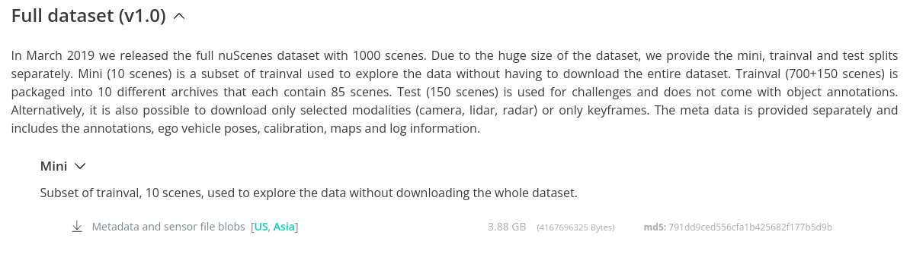

<div align="center">
  <h1>nuScenes LiDAR points to depth image</h1>
</div>
Change nuScene LiDAR points to depth image of front camera. To use in other dataset, check tools/Lidar2Camera.py and tools/SE3.py and NuscenesPCD2IMG2D.py.     

## Dependency
open3d  
numpy  
scipy  
opencv  

## Download mini dataset.
nuScenes dataset download link: https://www.nuscenes.org/nuscenes


**Copy nuscene data to ./nuscene_data**

if you want other set like part 1.. you should change NuscenesPCD2IMG2D.py

## Download nuScene devkit.
nuScene devkit: https://github.com/nutonomy/nuscenes-devkit

**Copy nuscenes-devkit/python-sdk/nuscenes to ./nuscenes**


## File structure
```
directories only
.
├── nuscene_data
│   ├── maps
│   ├── samples
│   │   ├── CAM_BACK
│   │   ├── CAM_BACK_LEFT
│   │   ├── CAM_BACK_RIGHT
│   │   ├── CAM_FRONT
│   │   ├── CAM_FRONT_LEFT
│   │   ├── CAM_FRONT_RIGHT
│   │   ├── LIDAR_TOP
│   │   ├── RADAR_BACK_LEFT
│   │   ├── RADAR_BACK_RIGHT
│   │   ├── RADAR_FRONT
│   │   ├── RADAR_FRONT_LEFT
│   │   └── RADAR_FRONT_RIGHT
│   ├── sweeps
│   │   ├── CAM_BACK
│   │   ├── CAM_BACK_LEFT
│   │   ├── CAM_BACK_RIGHT
│   │   ├── CAM_FRONT
│   │   ├── CAM_FRONT_LEFT
│   │   ├── CAM_FRONT_RIGHT
│   │   ├── LIDAR_TOP
│   │   ├── RADAR_BACK_LEFT
│   │   ├── RADAR_BACK_RIGHT
│   │   ├── RADAR_FRONT
│   │   ├── RADAR_FRONT_LEFT
│   │   └── RADAR_FRONT_RIGHT
│   └── v1.0-mini
├── nuscene_lidar_2d_depth
├── nuscene_lidar_pcd
├── nuscenes
│   ├── can_bus
│   ├── eval
│   │   ├── common
│   │   ├── detection
│   │   │   ├── configs
│   │   │   └── tests
│   │   ├── lidarseg
│   │   │   └── tests
│   │   ├── panoptic
│   │   ├── prediction
│   │   │   ├── configs
│   │   │   ├── docker_container
│   │   │   │   └── docker
│   │   │   ├── submission
│   │   │   └── tests
│   │   └── tracking
│   │       ├── configs
│   │       └── tests
│   ├── lidarseg
│   │   └── __pycache__
│   ├── map_expansion
│   │   └── tests
│   ├── panoptic
│   │   └── __pycache__
│   ├── prediction
│   │   ├── input_representation
│   │   │   └── tests
│   │   ├── models
│   │   └── tests
│   ├── __pycache__
│   ├── scripts
│   ├── tests
│   └── utils
│       ├── __pycache__
│       └── tests
└── tools
    └── __pycache__

```

## Usage
```
python3 NuscenesPCDBIN2PCD.py
python3 NuscenesPCD2IMG2D.py
```

You can get front camera depth image in nuscene_lidar_2d_depth directory.